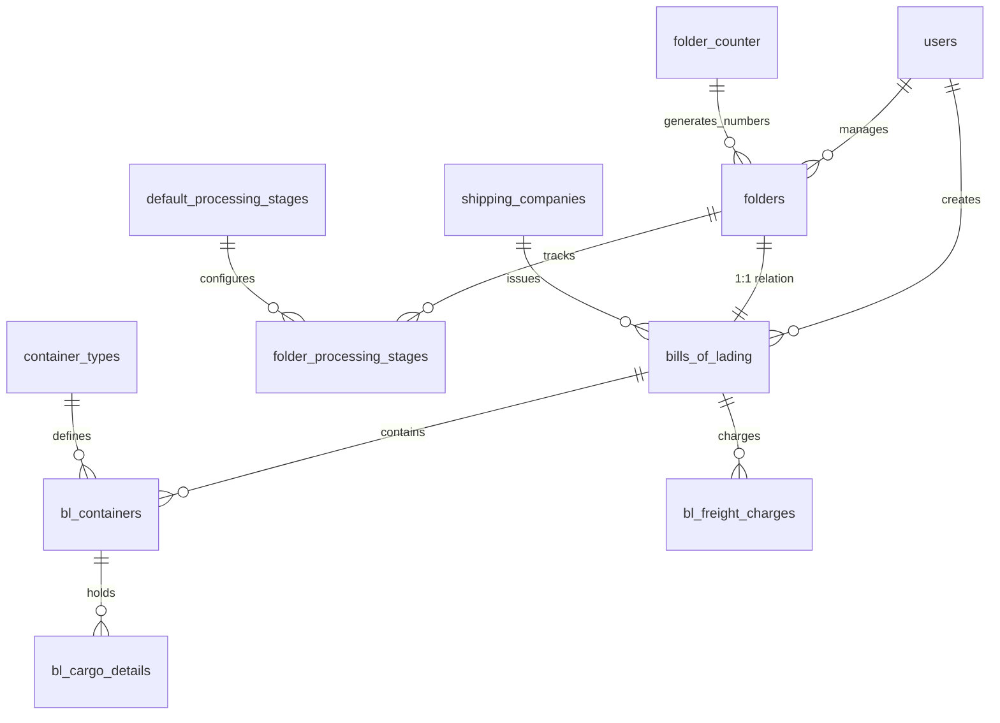

# Documentation du Schéma de Base de Données - njillu-app

## Vue d'Ensemble

Le système de base de données de njillu-app gère un écosystème complet de gestion logistique comprenant :
- **Gestion des utilisateurs** avec authentification Supabase
- **Système de dossiers** avec numérotation automatique  
- **Bills of Lading (BL)** avec relation 1:1 aux dossiers
- **Système d'étapes de traitement** avec workflow configurable
- **Gestion des conteneurs** et types de conteneurs
- **Compagnies maritimes** et frais de transport
- **Analytics et reporting** intégrés
- **Soft delete** et audit trail complets

## 🏗️ Architecture Globale

### Relations Principales



## 📊 Tables et Structures

### 👤 Table `users` - Gestion des Utilisateurs

**Description** : Profils utilisateurs étendant Supabase Auth avec système de rôles.

```sql
CREATE TABLE public.users (
  id uuid PRIMARY KEY REFERENCES auth.users(id) ON DELETE CASCADE,
  email varchar(255) NOT NULL UNIQUE,
  first_name varchar(100) NOT NULL,
  last_name varchar(100) NOT NULL,
  phone varchar(50),
  avatar_url text,
  role user_role NOT NULL DEFAULT 'user',
  created_at timestamptz DEFAULT now() NOT NULL,
  updated_at timestamptz DEFAULT now() NOT NULL
);
```

**Enums Associés** :
- `user_role` : 'super_admin', 'admin', 'user', 'visitor'

**Index** :
- `idx_users_email` : Recherche rapide par email
- `idx_users_role` : Filtrage par rôle
- `idx_users_created_at` : Tri chronologique

---

### 📁 Table `folders` - Système de Numérotation de Dossiers

**Description** : Gestion des dossiers avec numérotation automatique et relation 1:1 avec les BL.

```sql
CREATE TABLE public.folders (
  id uuid PRIMARY KEY DEFAULT gen_random_uuid(),
  folder_number varchar(15) UNIQUE NOT NULL, -- Format: M250804-000001
  transport_type transport_type_enum NOT NULL,
  status folder_status_enum NOT NULL DEFAULT 'draft',
  title varchar(255),
  description text,
  client_reference varchar(100),
  folder_date date NOT NULL DEFAULT CURRENT_DATE,
  expected_delivery_date date,
  actual_delivery_date date,
  priority varchar(20) DEFAULT 'normal',
  estimated_value numeric,
  estimated_value_currency varchar(3) DEFAULT 'EUR',
  internal_notes text,
  client_notes text,
  bl_id uuid UNIQUE REFERENCES bills_of_lading(id),
  assigned_to uuid REFERENCES users(id),
  created_by uuid REFERENCES users(id),
  created_at timestamptz DEFAULT now() NOT NULL,
  updated_at timestamptz DEFAULT now() NOT NULL,
  deleted_at timestamptz,
  deleted_by uuid REFERENCES users(id)
);
```

**Enums Associés** :
- `transport_type_enum` : 'M' (Maritime), 'T' (Terrestre), 'A' (Aérien)
- `folder_status_enum` : 'draft', 'active', 'shipped', 'delivered', 'completed', 'cancelled', 'archived'

**Fonctionnalités Clés** :
- **Numérotation automatique** : M250804-000001 (Transport + Date + Compteur)
- **Compteur global unique** thread-safe avec retry logic
- **Trigger automatique** `set_folder_number_trigger` pour génération du numéro
- **Relation 1:1** avec bills_of_lading via contraintes bidirectionnelles

---

### 🔄 Tables `folder_processing_stages` & `default_processing_stages` - Système d'Étapes de Traitement

**Description** : Système complet de gestion du workflow logistique avec 8 étapes métier configurables.

#### Table `folder_processing_stages` - Suivi des Étapes par Dossier

```sql
CREATE TABLE public.folder_processing_stages (
  id uuid PRIMARY KEY DEFAULT gen_random_uuid(),
  folder_id uuid NOT NULL REFERENCES folders(id) ON DELETE CASCADE,
  
  -- Configuration de l'étape
  stage processing_stage_enum NOT NULL,
  status stage_status_enum NOT NULL DEFAULT 'pending',
  priority stage_priority_enum NOT NULL DEFAULT 'normal',
  sequence_order integer NOT NULL,
  
  -- Métadonnées du workflow
  is_mandatory boolean NOT NULL DEFAULT true,
  can_be_skipped boolean NOT NULL DEFAULT false,
  requires_approval boolean NOT NULL DEFAULT false,
  
  -- Assignation et progression
  assigned_to uuid REFERENCES users(id),
  started_by uuid REFERENCES users(id),
  completed_by uuid REFERENCES users(id),
  approved_by uuid REFERENCES users(id),
  
  -- Timing et durées
  estimated_duration interval,
  actual_duration interval,
  deadline_date timestamptz,
  started_at timestamptz,
  completed_at timestamptz,
  
  -- Métadonnées
  completion_notes text,
  blocking_reason text,
  attached_documents jsonb DEFAULT '[]',
  custom_metadata jsonb DEFAULT '{}',
  
  -- Audit trail
  created_by uuid REFERENCES users(id),
  updated_by uuid REFERENCES users(id),
  created_at timestamptz DEFAULT now() NOT NULL,
  updated_at timestamptz DEFAULT now() NOT NULL
);
```

#### Table `default_processing_stages` - Configuration par Défaut

```sql
CREATE TABLE public.default_processing_stages (
  id uuid PRIMARY KEY DEFAULT gen_random_uuid(),
  stage processing_stage_enum NOT NULL UNIQUE,
  sequence_order integer NOT NULL UNIQUE,
  
  -- Configuration par défaut
  default_priority stage_priority_enum NOT NULL DEFAULT 'normal',
  is_mandatory boolean NOT NULL DEFAULT true,
  can_be_skipped boolean NOT NULL DEFAULT false,
  requires_approval boolean NOT NULL DEFAULT false,
  default_duration interval,
  
  -- Métadonnées
  description text,
  instructions text,
  required_documents jsonb DEFAULT '[]',
  
  -- Audit
  is_active boolean DEFAULT true,
  created_by uuid REFERENCES users(id),
  updated_by uuid REFERENCES users(id),
  created_at timestamptz DEFAULT now() NOT NULL,
  updated_at timestamptz DEFAULT now() NOT NULL
);
```

**Enums Associés** :
- `processing_stage_enum` : 8 étapes métier (enregistrement, révision_facture_commerciale, elaboration_fdi, elaboration_rfcv, declaration_douaniere, service_exploitation, facturation_client, livraison)
- `stage_status_enum` : 5 statuts (pending, in_progress, completed, blocked, skipped)
- `stage_priority_enum` : 4 priorités (low, normal, high, urgent)

**Fonctionnalités Clés** :
- **Workflow configurable** : 8 étapes du processus logistique complet
- **Gestion des états** : Suivi en temps réel du statut de chaque étape
- **Calcul de progression** : Pourcentage d'avancement automatique
- **Analytics intégrées** : Métriques et KPIs en temps réel
- **Assignation flexible** : Attribution des tâches aux utilisateurs
- **Durées calculées** : Estimation vs réalité avec optimisations
- **Documents attachés** : Gestion des pièces jointes par étape
- **Système d'approbation** : Validation requise pour étapes critiques

**Contraintes** :
- `UNIQUE(folder_id, stage)` : Une seule instance d'étape par dossier
- `CHECK(started_at <= completed_at)` : Cohérence temporelle
- `CHECK(sequence_order > 0)` : Ordre séquentiel valide

---

### 🔢 Table `folder_counter` - Compteur Global

**Description** : Compteur global thread-safe pour génération des numéros de dossier.

```sql
CREATE TABLE public.folder_counter (
  year integer PRIMARY KEY,
  counter integer NOT NULL DEFAULT 0,
  created_at timestamptz DEFAULT now() NOT NULL,
  updated_at timestamptz DEFAULT now() NOT NULL,
  CONSTRAINT folder_counter_year_valid CHECK (year >= 2020 AND year <= 2050),
  CONSTRAINT folder_counter_positive CHECK (counter >= 0)
);
```

**Fonctions Associées** :
- `generate_folder_number(transport_type, date)` : Génération thread-safe
- `preview_next_folder_number(transport_type, date)` : Prévisualisation
- `reset_folder_counter(year, value)` : Réinitialisation admin

---

### 🚢 Table `bills_of_lading` - Bills of Lading

**Description** : Documents de transport maritime avec relation 1:1 aux dossiers.

```sql
CREATE TABLE public.bills_of_lading (
  id uuid PRIMARY KEY DEFAULT gen_random_uuid(),
  bl_number varchar(50) UNIQUE NOT NULL,
  booking_reference varchar(50),
  export_reference varchar(100),
  service_contract varchar(50),
  shipping_company_id uuid NOT NULL REFERENCES shipping_companies(id),
  shipper_info jsonb NOT NULL DEFAULT '{}',
  consignee_info jsonb NOT NULL DEFAULT '{}',
  notify_party_info jsonb DEFAULT '{}',
  port_of_loading varchar(100) NOT NULL,
  port_of_discharge varchar(100) NOT NULL,
  place_of_receipt varchar(100),
  place_of_delivery varchar(100),
  vessel_name varchar(100),
  voyage_number varchar(50),
  vessel_imo_number varchar(20),
  issue_date date NOT NULL,
  shipped_on_board_date date,
  estimated_arrival_date date,
  freight_terms freight_terms NOT NULL DEFAULT 'prepaid',
  loading_method loading_method NOT NULL DEFAULT 'FCL',
  cargo_description text,
  total_packages integer,
  total_gross_weight_kg numeric,
  total_volume_cbm numeric,
  declared_value_amount numeric,
  declared_value_currency varchar(3),
  status bl_status DEFAULT 'draft',
  folder_id uuid UNIQUE REFERENCES folders(id),
  created_by uuid REFERENCES users(id),
  updated_by uuid REFERENCES users(id),
  created_at timestamptz DEFAULT now() NOT NULL,
  updated_at timestamptz DEFAULT now() NOT NULL,
  deleted_at timestamptz,
  deleted_by uuid REFERENCES users(id)
);
```

**Enums Associés** :
- `bl_status` : 'draft', 'issued', 'shipped', 'discharged', 'delivered', 'cancelled'
- `freight_terms` : 'prepaid', 'collect', 'prepaid_collect'
- `loading_method` : 'FCL', 'LCL', 'RORO', 'BREAK_BULK'

**Champs JSON** :
- `shipper_info` : Informations expéditeur (name, address, city, country, etc.)
- `consignee_info` : Informations destinataire
- `notify_party_info` : Partie à notifier

---

### 🏢 Table `shipping_companies` - Compagnies Maritimes

**Description** : Compagnies maritimes émettrices des BL.

```sql
CREATE TABLE public.shipping_companies (
  id uuid PRIMARY KEY DEFAULT gen_random_uuid(),
  name varchar(255) NOT NULL,
  short_name varchar(100),
  scac_code varchar(4), -- Standard Carrier Alpha Code
  iata_code varchar(3),
  headquarters_country varchar(2), -- ISO 3166-1 alpha-2
  headquarters_city varchar(100),
  headquarters_address text,
  contact_info jsonb DEFAULT '{}',
  status shipping_company_status DEFAULT 'active',
  founded_year integer,
  fleet_size integer,
  created_by uuid REFERENCES users(id),
  created_at timestamptz DEFAULT now() NOT NULL,
  updated_at timestamptz DEFAULT now() NOT NULL,
  deleted_at timestamptz,
  deleted_by uuid REFERENCES users(id)
);
```

**Enums Associés** :
- `shipping_company_status` : 'active', 'inactive', 'suspended'

---

### 📦 Table `container_types` - Types de Conteneurs

**Description** : Catalogue des types de conteneurs avec spécifications techniques.

```sql
CREATE TABLE public.container_types (
  id uuid PRIMARY KEY DEFAULT gen_random_uuid(),
  iso_code varchar(10) UNIQUE NOT NULL, -- Ex: 20GP, 40HC, 40HQ, 20RF
  description varchar(255) NOT NULL,
  category container_category NOT NULL,
  size_feet integer NOT NULL,
  height_type container_height_type NOT NULL DEFAULT 'standard',
  length_meters numeric,
  width_meters numeric,
  height_meters numeric,
  internal_length_meters numeric,
  internal_width_meters numeric,
  internal_height_meters numeric,
  tare_weight_kg integer,
  max_payload_kg integer,
  max_gross_weight_kg integer,
  volume_cubic_meters numeric,
  teu_equivalent numeric NOT NULL DEFAULT 1,
  special_features jsonb DEFAULT '{}',
  is_active boolean DEFAULT true,
  created_at timestamptz DEFAULT now() NOT NULL,
  updated_at timestamptz DEFAULT now() NOT NULL,
  deleted_at timestamptz,
  deleted_by uuid REFERENCES users(id)
);
```

**Enums Associés** :
- `container_category` : 'general_purpose', 'high_cube', 'refrigerated', 'open_top', 'flat_rack', 'tank', 'ventilated', 'bulk', 'platform', 'roro'
- `container_height_type` : 'standard', 'high_cube'

---

### 📦 Table `bl_containers` - Conteneurs des BL

**Description** : Conteneurs associés aux Bills of Lading.

```sql
CREATE TABLE public.bl_containers (
  id uuid PRIMARY KEY DEFAULT gen_random_uuid(),
  bl_id uuid NOT NULL REFERENCES bills_of_lading(id),
  container_type_id uuid NOT NULL REFERENCES container_types(id),
  container_number varchar(20) NOT NULL, -- Format ISO: 4 lettres + 7 chiffres
  seal_number varchar(50),
  tare_weight_kg integer,
  gross_weight_kg numeric,
  net_weight_kg numeric,
  volume_cbm numeric,
  loading_method loading_method NOT NULL DEFAULT 'FCL',
  marks_and_numbers text,
  shipper_load_stow_count boolean DEFAULT false,
  created_at timestamptz DEFAULT now() NOT NULL,
  updated_at timestamptz DEFAULT now() NOT NULL,
  deleted_at timestamptz,
  deleted_by uuid REFERENCES users(id)
);
```

---

### 📋 Table `bl_cargo_details` - Détails Marchandises

**Description** : Détails des marchandises par conteneur.

```sql
CREATE TABLE public.bl_cargo_details (
  id uuid PRIMARY KEY DEFAULT gen_random_uuid(),
  container_id uuid NOT NULL REFERENCES bl_containers(id),
  hs_code varchar(10), -- Code SH (Système Harmonisé)
  commodity_code varchar(20),
  description text NOT NULL,
  quantity integer,
  unit_type varchar(20),
  weight_kg numeric,
  volume_cbm numeric,
  marks_and_numbers text,
  number_of_packages integer,
  package_type varchar(50),
  created_at timestamptz DEFAULT now() NOT NULL,
  updated_at timestamptz DEFAULT now() NOT NULL,
  deleted_at timestamptz,
  deleted_by uuid REFERENCES users(id)
);
```

---

### 💰 Table `bl_freight_charges` - Frais de Transport

**Description** : Frais et charges associés aux Bills of Lading.

```sql
CREATE TABLE public.bl_freight_charges (
  id uuid PRIMARY KEY DEFAULT gen_random_uuid(),
  bl_id uuid NOT NULL REFERENCES bills_of_lading(id),
  charge_type charge_type NOT NULL,
  charge_category charge_category NOT NULL DEFAULT 'mandatory',
  description text NOT NULL,
  charge_code varchar(20),
  amount numeric NOT NULL,
  currency varchar(3) NOT NULL DEFAULT 'USD',
  calculation_basis calculation_basis NOT NULL,
  quantity numeric,
  unit_rate numeric,
  paid_by varchar(20) DEFAULT 'shipper',
  payment_status varchar(20) DEFAULT 'pending',
  invoice_number varchar(50),
  invoice_date date,
  due_date date,
  tax_rate numeric DEFAULT 0,
  tax_amount numeric DEFAULT 0,
  total_amount numeric,
  period_start date,
  period_end date,
  notes text,
  is_active boolean DEFAULT true,
  created_by uuid REFERENCES users(id),
  created_at timestamptz DEFAULT now() NOT NULL,
  updated_at timestamptz DEFAULT now() NOT NULL,
  deleted_at timestamptz,
  deleted_by uuid REFERENCES users(id)
);
```

**Enums Associés** :
- `charge_type` : 25+ types (ocean_freight, thc_origin, documentation, etc.)
- `charge_category` : 'mandatory', 'optional', 'regulatory', 'surcharge', 'penalty'
- `calculation_basis` : 'per_container', 'per_teu', 'per_weight', 'per_volume', etc.

## 📊 Vues Statistiques

### Vues Analytics Intégrées

Le système inclut plusieurs vues pour le reporting et analytics :

**Vues par Transport** :
- `folder_stats_by_transport` : Statistiques complètes par type de transport
- `folder_stats_by_period` : Analyse temporelle par mois/année
- `folder_stats_by_assignee` : Performance par utilisateur assigné

**Dashboard Exécutif** :
- `executive_dashboard` : KPIs principaux et métriques de croissance
- `folders_requiring_attention` : Système d'alertes avec scoring automatique

**Vues Analytics Étapes de Traitement** :
- `folder_stage_statistics` : Statistiques détaillées par étape avec temps moyens
- `folders_with_stage_progress` : Progression en temps réel par dossier avec pourcentages
- `stage_alerts_dashboard` : Alertes intelligentes (retards, blocages, échéances)
- `executive_stage_dashboard` : Vue exécutive des performances globales par étape

**Vues Actives (Soft Delete)** :
- `active_bills_of_lading` : BL non supprimés
- `active_bl_containers` : Conteneurs actifs
- `active_bl_cargo_details` : Marchandises actives
- `active_bl_freight_charges` : Frais actifs
- `active_shipping_companies` : Compagnies actives
- `active_container_types` : Types de conteneurs actifs

**Vues Relationnelles** :
- `folders_with_bl` : Dossiers avec leurs BL associés
- `bl_with_folders` : BL avec leurs dossiers associés

## 🔐 Sécurité et RLS (Row Level Security)

### Politiques RLS par Table

**Table `users`** :
- `users_select_all` : SELECT pour tous les utilisateurs authentifiés
- `users_insert_own` : INSERT uniquement pour son propre profil
- `users_update_own` : UPDATE uniquement pour son propre profil

**Table `folders`** :
- `folders_select_all` : SELECT pour tous les utilisateurs authentifiés
- `folders_insert_authenticated` : INSERT pour utilisateurs authentifiés
- `folders_update_own_or_assigned` : UPDATE pour créateur ou assigné
- `folders_delete_own` : Soft delete pour créateur uniquement

**Tables BL et Relations** :
- Politiques similaires avec contrôle par créateur/assigné
- Soft delete sécurisé avec audit trail
- Contraintes d'intégrité référentielle

**Tables Étapes de Traitement** :
- `folder_processing_stages_select_optimized` : SELECT optimisé avec `(SELECT auth.uid())`
- `folder_processing_stages_insert_authenticated` : INSERT pour utilisateurs authentifiés
- `folder_processing_stages_update_permission` : UPDATE selon permissions et assignations
- `default_stages_select_optimized` : SELECT optimisé pour configuration
- `default_stages_*_super_admin` : INSERT/UPDATE/DELETE pour super_admin uniquement

### Fonctions de Sécurité

**Soft Delete System** :
- `soft_delete_bl(uuid, uuid)` : Suppression sécurisée en cascade
- `restore_bl(uuid, uuid)` : Restauration avec audit
- `get_deleted_records()` : Audit des suppressions

**Fonctions Helper d'Étapes** :
- `user_can_access_folder(uuid, uuid)` : Validation d'accès aux dossiers
- `user_can_modify_stage(uuid, uuid)` : Permissions de modification d'étape
- `user_can_approve_stage(uuid, uuid)` : Permissions d'approbation d'étape

**Validation et Contrôles** :
- Triggers de validation automatique
- Contraintes CHECK sur formats et valeurs
- Search path sécurisé (SECURITY DEFINER) - 72 fonctions protégées

## 🔧 Fonctions et Triggers

### Fonctions de Numérotation

**Génération de Numéros** :
```sql
-- Génération thread-safe de numéros de dossier
generate_folder_number(transport_type_enum, date) → varchar(15)

-- Prévisualisation du prochain numéro
preview_next_folder_number(transport_type_enum, date) → varchar(15)

-- Réinitialisation compteur (admin)
reset_folder_counter(integer, integer) → boolean
```

### Fonctions de Gestion des Étapes

**Fonctions Métier** :
```sql
-- Initialisation des étapes pour un dossier
initialize_folder_stages(uuid, uuid) → boolean

-- Démarrer une étape avec assignation
start_processing_stage(uuid, processing_stage_enum, uuid, uuid, text) → boolean

-- Compléter une étape avec notes et documents
complete_processing_stage(uuid, processing_stage_enum, uuid, text, text[]) → boolean

-- Bloquer/débloquer une étape
block_processing_stage(uuid, processing_stage_enum, text, uuid) → boolean
unblock_processing_stage(uuid, processing_stage_enum, uuid, text) → boolean

-- Calculer la progression d'un dossier
get_folder_progress(uuid) → table(total_stages, completed_stages, completion_percentage)
```

**Fonctions Helper de Sécurité** :
```sql
-- Validation des permissions d'accès
user_can_access_folder(uuid, uuid) → boolean
user_can_modify_stage(uuid, uuid) → boolean  
user_can_approve_stage(uuid, uuid) → boolean
```

**Triggers Automatiques** :
- `set_folder_number_trigger` : Auto-génération des numéros de dossier
- `update_*_updated_at` : Mise à jour automatique des timestamps
- `validate_folder_bl_relationship_*` : Validation des relations 1:1
- `trg_calculate_stage_actual_duration` : Calcul automatique des durées réelles d'étapes

### Fonctions de Relation Dossier-BL

**Gestion des Liens** :
```sql
-- Lier un dossier à un BL
link_folder_to_bl(uuid, uuid) → boolean

-- Délier un dossier d'un BL
unlink_folder_from_bl(uuid) → boolean

-- Échanger les liens entre deux dossiers
swap_folder_bl_links(uuid, uuid) → boolean

-- Réassignation en masse
bulk_reassign_folder_bl_links(jsonb) → boolean
```

### Fonctions Utilitaires

**Validation** :
```sql
-- Validation format numéro de dossier
validate_folder_number(varchar) → boolean

-- Obtention d'informations complètes
get_folder_with_bl(uuid) → table

-- Statistiques période
get_period_statistics(date, date) → table
```

## 📋 Index et Performances

### Index Principaux

**Table `folders`** :
- `idx_folders_folder_number` : UNIQUE sur folder_number
- `idx_folders_transport_type` : Filtrage par type
- `idx_folders_status` : Filtrage par statut
- `idx_folders_folder_date` : Tri chronologique
- `idx_folders_not_deleted` : Dossiers non supprimés (partial, optimisé)

**Table `folder_processing_stages`** :
- `idx_fps_folder_stage_unique` : UNIQUE(folder_id, stage)
- `idx_fps_status_priority` : Filtrage par statut et priorité
- `idx_fps_sequence_order` : Tri par ordre séquentiel
- `idx_fps_assignment_optimization` : Optimisation requêtes d'assignation
- `idx_fps_deadline_date` : Suivi des échéances

**Table `default_processing_stages`** :
- `idx_dps_stage_unique` : UNIQUE sur stage
- `idx_dps_sequence_order` : UNIQUE sur sequence_order
- `idx_dps_active` : Configurations actives uniquement

**Table `bills_of_lading`** :
- `idx_bl_bl_number` : UNIQUE sur bl_number
- `idx_bl_shipping_company` : Regroupement par compagnie
- `idx_bl_issue_date` : Tri par date d'émission
- `idx_bl_ports` : Recherche par ports

**Optimisations Soft Delete** :
- Index partiels `WHERE deleted_at IS NULL` pour performances
- Index sur `deleted_at DESC, deleted_by` pour audit

## 🔄 Migrations et Évolution

### Migrations Actuelles (34 fichiers)

**Système de Base** :
1. `20250727095022_create_basic_users_table.sql`
2. `20250727095145_basic_users_rls_policies.sql`
3. `20250727101129_fix_functions_search_path.sql`
4. `20250727125058_add_user_roles_enum.sql`

**Système BL et Conteneurs** :
5. `20250804115836_create_shipping_companies_table.sql`
6. `20250804120002_create_container_types_table.sql`
7. `20250804120545_create_bills_of_lading_tables.sql`
8. `20250804121404_create_freight_charges_table.sql`
9. `20250804121526_configure_bl_rls_policies.sql`

**Soft Delete System** :
10. `20250804123316_add_soft_delete_columns.sql`
11. `20250804123409_create_soft_delete_functions.sql`
12. `20250804123536_update_rls_for_soft_delete.sql`

**Système de Dossiers** :
13. `20250804141245_create_folders_table_and_enums.sql`
14. `20250804141530_create_folder_counter_and_generation_function.sql`
15. `20250804141648_create_folder_bl_relationship_and_indexes.sql`
16. `20250804142248_create_folder_rls_policies_and_soft_delete.sql`

**Analytics et Vues** :
17. `20250804142404_create_folder_statistical_views.sql`
18. `20250804145411_create_folder_bl_reassignment_functions.sql`
19. `20250804171803_add_soft_delete_columns.sql` (corrections)
20. `20250804182206_add_container_arrival_tracking_system.sql`
21. `20250804182318_enhance_folder_alerts_with_container_tracking.sql`

**Optimisations Performance et Sécurité** :
22. `20250805190000_fix_search_path_only.sql`
23. `20250805191500_optimize_rls_policies_performance.sql`
24. `20250805192000_consolidate_multiple_permissive_policies.sql`
25. `20250805192500_cleanup_duplicate_indexes.sql`

**Système d'Étapes de Traitement** :
26. `20250806075915_create_folder_processing_stages_system.sql`
27. `20250806080019_create_folder_processing_stages_functions.sql`
28. `20250806080302_create_folder_processing_stages_analytics_views.sql`
29. `20250806080433_create_folder_processing_stages_rls_policies.sql`

**Sécurité et Optimisations Finales** :
30. `20250806083751_fix_all_search_path_security_issues.sql`
31. `20250806084902_fix_search_path_empty_string.sql`
32. `20250806190000_fix_rls_performance_final.sql`
33. `20250806195000_cleanup_performance_issues.sql`
34. `20250806200000_fix_final_policy_conflict.sql`

### Commandes de Migration

```bash
# Réinitialiser et appliquer toutes les migrations
supabase db reset

# Appliquer les nouvelles migrations seulement
supabase migration up

# Vérifier le statut des migrations
supabase migration list

# Générer une nouvelle migration
./scripts/generate-migration.sh "description_of_changes"
```

## 📊 Exemples d'Utilisation

### Création d'un Dossier avec BL

```typescript
// 1. Créer un dossier (numéro auto-généré)
const { data: folder } = await supabase
  .from('folders')
  .insert({
    transport_type: 'M',
    title: 'Expédition Marseille-Casablanca',
    priority: 'urgent'
  })
  .select()
  .single();

// 2. Créer le BL associé
const { data: bl } = await supabase
  .from('bills_of_lading')
  .insert({
    bl_number: 'MSCU1234567',
    shipping_company_id: companyId,
    shipper_info: { name: 'Acme Corp', address: '123 Main St' },
    consignee_info: { name: 'Import Ltd', address: '456 Oak Ave' },
    port_of_loading: 'Marseille',
    port_of_discharge: 'Casablanca',
    issue_date: '2025-08-04'
  })
  .select()
  .single();

// 3. Lier le dossier au BL
await supabase.rpc('link_folder_to_bl', {
  p_folder_id: folder.id,
  p_bl_id: bl.id
});
```

### Requêtes Analytics

```sql
-- Statistiques par type de transport
SELECT * FROM folder_stats_by_transport;

-- Dashboard exécutif
SELECT 
  total_active_folders,
  folders_with_bl,
  bl_link_rate,
  global_completion_rate
FROM executive_dashboard;

-- Dossiers nécessitant attention
SELECT 
  folder_number,
  transport_type,
  priority,
  issues,
  attention_score
FROM folders_requiring_attention
ORDER BY attention_score DESC;

-- Analytics des étapes de traitement
SELECT 
  stage_name,
  total_instances,
  completed_instances,
  avg_duration_hours,
  completion_rate
FROM folder_stage_statistics;

-- Progression des dossiers en temps réel
SELECT 
  folder_number,
  current_stage,
  completion_percentage,
  estimated_completion_date,
  is_delayed
FROM folders_with_stage_progress
WHERE completion_percentage < 100;

-- Alertes et retards
SELECT 
  folder_number,
  stage_name,
  alert_type,
  severity,
  days_overdue,
  assigned_to_name
FROM stage_alerts_dashboard
WHERE severity IN ('high', 'urgent');
```

## 🚀 État Actuel et Prochaines Étapes

### Fonctionnalités Opérationnelles

✅ **Système de numérotation** : Format M250804-000001 avec compteur global thread-safe  
✅ **Relations dossier-BL** : 1:1 bidirectionnel avec fonctions de réassignation  
✅ **Système d'étapes de traitement** : 8 étapes métier configurables avec workflow complet
✅ **Analytics temps réel** : 4 vues analytics d'étapes + dashboard exécutif  
✅ **Gestion des états** : Suivi complet pending → in_progress → completed
✅ **Soft delete complet** : Audit trail et restauration sur toutes les tables  
✅ **Sécurité RLS** : Contrôle d'accès granulaire avec 72 fonctions protégées
✅ **Performance** : Index optimisés, politiques RLS ultra-performantes, 0 problème restant

### Évolutions Possibles

- **Workflow avancé** : États et transitions de dossiers configurables (partiellement implémenté avec les étapes)
- **Notifications** : Système d'alertes automatiques et emails basé sur stage_alerts_dashboard
- **API GraphQL** : Exposition des données via Supabase GraphQL
- **Intégrations** : Connecteurs vers systèmes externes (EDI, APIs) 
- **Machine Learning** : Prédictions de délais basées sur l'historique des durées d'étapes
- **Mobile App** : Interface mobile pour suivi temps réel des étapes
- **Automatisation avancée** : Transitions automatiques d'étapes basées sur des conditions

Cette architecture enterprise offre une base solide et évolutive pour la gestion complète des opérations logistiques avec traçabilité, sécurité et performance optimales.