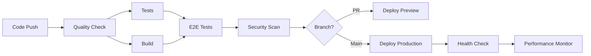

# Production Deployment Guide

Complete guide for deploying the responsive list-detail layout system to production.

## Table of Contents

1. [Prerequisites](#prerequisites)
2. [Environment Setup](#environment-setup)
3. [CI/CD Pipeline](#cicd-pipeline)
4. [Deployment Process](#deployment-process)
5. [Performance Optimization](#performance-optimization)
6. [Monitoring & Maintenance](#monitoring--maintenance)
7. [Troubleshooting](#troubleshooting)
8. [Rollback Procedures](#rollback-procedures)

## Prerequisites

### Required Accounts & Services

- [x] **Vercel Account** - For application hosting
- [x] **Supabase Project** - For backend services
- [x] **GitHub Repository** - For source code and CI/CD
- [x] **Sentry Account** - For error monitoring (optional)
- [x] **Domain Provider** - For custom domain (optional)

### Development Environment

- [x] Node.js 20+ installed
- [x] pnpm 9+ installed  
- [x] Git configured
- [x] Supabase CLI installed (optional for local development)

```bash
# Verify installations
node --version  # v20+
pnpm --version  # 9+
git --version   # Any recent version
```

## Environment Setup

### 1. Supabase Project Setup

1. **Create Supabase Project**
   ```bash
   # Visit https://supabase.com/dashboard
   # Create new project
   # Note down: Project URL, Anon Key, Service Role Key
   ```

2. **Configure Database**
   ```sql
   -- Run initial migrations
   -- Database schema will be automatically created
   -- RLS policies are already configured
   ```

3. **Set up Authentication**
   ```bash
   # Authentication is pre-configured
   # Email templates are customizable in Supabase dashboard
   ```

### 2. Vercel Project Setup

1. **Create Vercel Project**
   ```bash
   # Install Vercel CLI
   pnpm add -g vercel
   
   # Link project
   vercel link
   ```

2. **Configure Environment Variables**
   ```bash
   # Production environment variables
   vercel env add NEXTAUTH_SECRET production
   vercel env add NEXT_PUBLIC_SUPABASE_URL production
   vercel env add NEXT_PUBLIC_SUPABASE_ANON_KEY production
   vercel env add SUPABASE_SERVICE_ROLE_KEY production
   vercel env add CRON_SECRET production
   vercel env add SENTRY_DSN production
   ```

### 3. Required Environment Variables

Create `.env.production.local` with:

```bash
# Application Configuration
NODE_ENV=production
NEXTAUTH_SECRET=your-super-secret-jwt-key-min-32-chars
APP_URL=https://your-domain.vercel.app

# Supabase Configuration
NEXT_PUBLIC_SUPABASE_URL=https://your-project-id.supabase.co
NEXT_PUBLIC_SUPABASE_ANON_KEY=your-anon-key
SUPABASE_SERVICE_ROLE_KEY=your-service-role-key
SUPABASE_PROJECT_ID=your-project-id

# Security & Monitoring
CRON_SECRET=your-secure-cron-secret-for-health-checks
SENTRY_DSN=https://your-sentry-dsn@sentry.io/project-id
VERCEL_ANALYTICS_ID=your-vercel-analytics-id

# Optional: Notifications
SLACK_WEBHOOK_URL=https://hooks.slack.com/services/...
DISCORD_WEBHOOK_URL=https://discord.com/api/webhooks/...
```

### 4. GitHub Repository Setup

1. **Configure Repository Secrets**
   ```
   Settings → Secrets and variables → Actions → New repository secret
   ```

   Required secrets:
   - `VERCEL_TOKEN` - Vercel deployment token
   - `VERCEL_ORG_ID` - Your Vercel organization ID
   - `VERCEL_PROJECT_ID` - Your Vercel project ID
   - `NEXT_PUBLIC_SUPABASE_URL` - Supabase project URL
   - `NEXT_PUBLIC_SUPABASE_ANON_KEY` - Supabase anonymous key
   - `SUPABASE_SERVICE_ROLE_KEY` - Supabase service role key
   - `SENTRY_DSN` - Sentry DSN for error tracking

2. **Enable Required GitHub Features**
   - [x] Actions (for CI/CD)
   - [x] Dependabot (for security updates)
   - [x] Security tab (for vulnerability scanning)
   - [x] Code scanning alerts

## CI/CD Pipeline

The automated CI/CD pipeline includes:

### Pipeline Stages



### Quality Gates

1. **Code Quality** (Required to pass)
   - Type checking with TypeScript
   - ESLint linting with auto-fix
   - Prettier formatting validation
   - Security audit (high-severity vulnerabilities block merge)

2. **Testing** (Required to pass)
   - Unit tests (minimum 80% coverage)
   - Integration tests (API and component integration)
   - E2E tests (cross-browser compatibility)
   - Accessibility tests (WCAG 2.1 AA compliance)

3. **Security** (Required to pass)
   - Dependency vulnerability scanning
   - Code security analysis (SAST)
   - Secret scanning
   - License compliance check

4. **Performance** (Warning only)
   - Bundle size analysis
   - Core Web Vitals validation
   - Performance regression detection

### Automated Deployment

- **Pull Requests** → Deploy to preview URL
- **Main Branch** → Deploy to production
- **Manual Trigger** → Available for all environments

## Deployment Process

### Manual Deployment

If you need to deploy manually:

```bash
# 1. Ensure all tests pass locally
pnpm test
pnpm test:e2e
pnpm lint
pnpm type-check

# 2. Build for production
pnpm build:production

# 3. Deploy to Vercel
vercel --prod

# 4. Verify deployment
pnpm health-check
```

### Automated Deployment (Recommended)

The CI/CD pipeline automatically handles:

1. **Pull Request Flow**
   ```
   Create PR → Tests Run → Preview Deploy → Review & Merge
   ```

2. **Production Flow**
   ```
   Merge to Main → Full Test Suite → Security Scan → Production Deploy → Health Check
   ```

### Deployment Verification

After deployment, the system automatically:

1. **Health Checks** 
   - API endpoint availability
   - Database connectivity  
   - System resource status
   - Core functionality validation

2. **Performance Validation**
   - Core Web Vitals measurement
   - Bundle size verification
   - Response time validation
   - Cross-browser compatibility

3. **Security Validation**
   - SSL certificate validation
   - Security headers verification
   - Authentication flow testing

## Performance Optimization

### Build Optimization

The production build includes:

- **Bundle Optimization**
  - Code splitting by routes and components
  - Tree shaking for unused code elimination
  - Compression and minification
  - Source map generation (hidden in production)

- **Image Optimization**  
  - Next.js Image component with WebP/AVIF support
  - Responsive image sizing
  - Lazy loading and blur placeholder
  - CDN optimization through Vercel

- **Caching Strategy**
  - Static assets cached for 1 year
  - API responses with appropriate TTL
  - Database query caching (5-15 minute TTL)
  - Browser caching with cache-control headers

### Runtime Optimization

- **Memory Management**
  - Process memory monitoring
  - Garbage collection optimization
  - Memory leak detection

- **Database Optimization**
  - Connection pooling
  - Query optimization
  - Row Level Security (RLS) performance
  - Index optimization

### Performance Targets

| Metric | Target | Measurement |
|--------|--------|-------------|
| First Contentful Paint | < 1.5s | Lighthouse |
| Largest Contentful Paint | < 2.5s | Lighthouse |
| Cumulative Layout Shift | < 0.1 | Lighthouse |
| Time to Interactive | < 3s | Lighthouse |
| Total Bundle Size | < 1MB | Bundle analyzer |
| API Response Time | < 500ms | Health checks |

## Monitoring & Maintenance

### Health Monitoring

**Automated Health Checks** run every 5 minutes:
- Application availability
- Database connectivity
- API response times
- Memory usage
- Error rates

**Performance Monitoring** runs hourly:
- Core Web Vitals tracking
- Bundle size monitoring
- Database performance metrics
- User experience metrics

### Error Tracking

**Sentry Integration** (Production):
- Real-time error tracking
- Performance monitoring
- Release tracking
- User context and breadcrumbs

**Log Management**:
- Structured logging with timestamps
- Error categorization and alerting
- Performance metrics logging
- Security event logging

### Alerting

Configure alerts for:
- **Critical**: Application down, database unreachable
- **High**: High error rates, performance degradation
- **Medium**: Security events, dependency vulnerabilities
- **Low**: Performance regression, resource usage

### Maintenance Tasks

**Daily**:
- [ ] Monitor error rates and performance
- [ ] Review security scan results
- [ ] Check system health metrics

**Weekly**:
- [ ] Review and merge dependency updates
- [ ] Analyze performance trends
- [ ] Review security alerts
- [ ] Update documentation if needed

**Monthly**:  
- [ ] Security audit and penetration testing
- [ ] Performance optimization review
- [ ] Disaster recovery testing
- [ ] Compliance review

**Quarterly**:
- [ ] Full security assessment
- [ ] Architecture review
- [ ] Capacity planning
- [ ] Business continuity testing

## Troubleshooting

### Common Issues

**Deployment Failures**

1. **Build Errors**
   ```bash
   # Check build logs
   vercel logs
   
   # Run build locally to debug
   pnpm build:production
   
   # Common fixes:
   # - Update environment variables
   # - Fix TypeScript errors
   # - Update dependencies
   ```

2. **Environment Variable Issues**
   ```bash
   # Verify all required variables are set
   vercel env ls
   
   # Pull environment variables locally
   vercel env pull .env.production.local
   ```

3. **Database Connection Issues**
   ```bash
   # Test database connectivity
   curl -X GET "https://your-app.vercel.app/api/health"
   
   # Check Supabase status
   # Visit: https://status.supabase.com/
   ```

**Performance Issues**

1. **High Response Times**
   ```bash
   # Check API performance
   pnpm health-check
   
   # Monitor database performance in Supabase dashboard
   # Review server logs in Vercel dashboard
   ```

2. **Bundle Size Issues**
   ```bash
   # Analyze bundle size
   pnpm build:analyze
   
   # Review webpack-bundle-analyzer output
   # Identify large dependencies for optimization
   ```

**Security Issues**

1. **Vulnerability Alerts**
   ```bash
   # Run security audit
   pnpm check:security
   
   # Update dependencies
   pnpm update --latest
   
   # Review and fix high/critical vulnerabilities
   ```

### Emergency Procedures

**Application Down**

1. **Immediate Response**
   - Check Vercel status and logs
   - Verify DNS and CDN status
   - Check database connectivity
   - Implement rollback if needed

2. **Communication**
   - Post status update
   - Notify stakeholders
   - Document incident timeline

**Database Issues**

1. **Connection Problems**
   - Check Supabase dashboard
   - Verify connection strings
   - Test with minimal query

2. **Performance Problems**  
   - Review slow query logs
   - Check connection pool status
   - Scale database if needed

**Security Incidents**

1. **Immediate Response**
   - Isolate affected systems
   - Preserve logs and evidence
   - Notify security team

2. **Investigation**
   - Analyze attack vectors
   - Check for data breaches
   - Document findings

## Rollback Procedures

### Automatic Rollback

The system includes automatic rollback triggers:
- Health checks fail after deployment
- Error rates exceed 5% threshold
- Critical security vulnerabilities detected

### Manual Rollback

1. **Vercel Rollback**
   ```bash
   # List recent deployments
   vercel ls
   
   # Rollback to previous version
   vercel rollback [deployment-url]
   
   # Or use Vercel dashboard
   ```

2. **Database Rollback**
   ```bash
   # If database changes were made
   supabase db reset
   
   # Or restore from backup
   # (Manual process through Supabase dashboard)
   ```

3. **Verification**
   ```bash
   # Verify rollback success
   pnpm health-check
   
   # Test critical functionality
   # Monitor error rates and performance
   ```

### Post-Rollback

1. **Investigation**
   - Identify root cause of issues
   - Document lessons learned
   - Plan remediation strategy

2. **Communication**
   - Notify stakeholders of resolution
   - Update status page
   - Schedule post-mortem if needed

## Performance Tuning Recommendations

### Database Optimization

1. **Query Optimization**
   - Use database indexing strategically
   - Optimize slow queries identified in logs
   - Implement query result caching
   - Use connection pooling efficiently

2. **RLS Policy Optimization**
   - Review Row Level Security policies for performance impact
   - Use efficient policy predicates
   - Consider policy bypass for admin operations

### Frontend Optimization

1. **Code Splitting**
   - Implement route-based code splitting
   - Split large component bundles
   - Use dynamic imports for heavy features

2. **Caching Strategy**
   - Implement service worker caching
   - Use CDN for static assets
   - Cache API responses appropriately

### Infrastructure Scaling

1. **Vercel Configuration**
   - Configure appropriate regions
   - Use Vercel Functions for API routes
   - Implement Edge Functions for global performance

2. **Database Scaling**
   - Monitor database metrics
   - Scale compute resources as needed
   - Consider read replicas for high-traffic applications

---

## Support & Resources

- **Documentation**: [Internal docs/]
- **Status Page**: https://status.your-domain.com
- **Support Team**: devops@your-domain.com
- **Emergency Contact**: +1-XXX-XXX-XXXX

This deployment guide is regularly updated. Last revision: [Current Date]