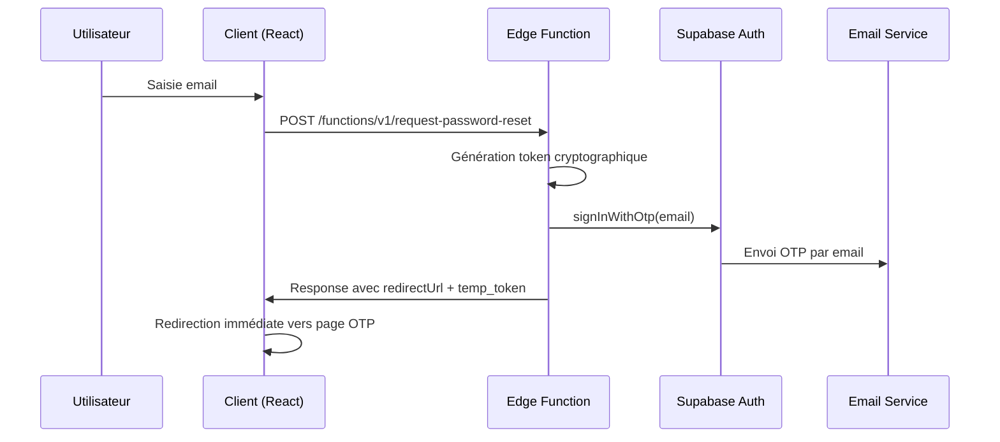
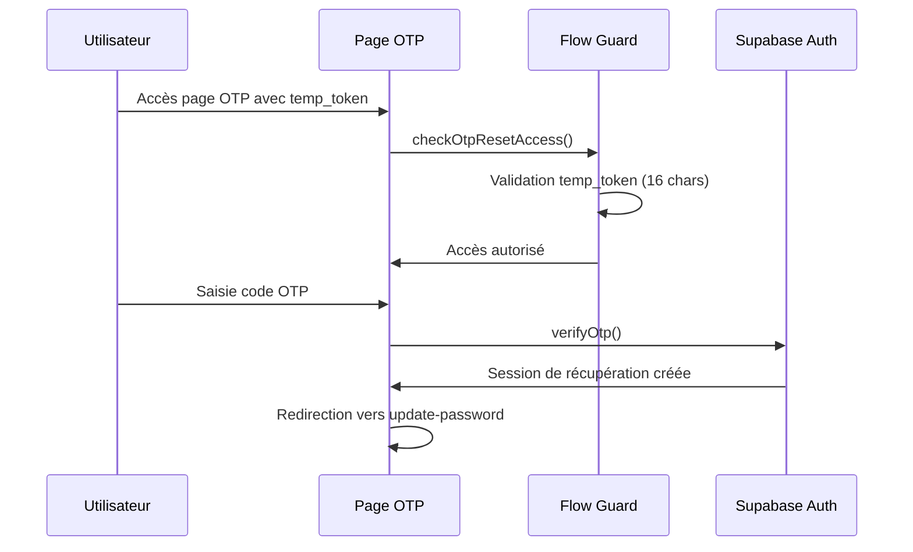

# Système de Réinitialisation de Mot de Passe Sécurisé

## Vue d'ensemble

Ce document décrit l'architecture de sécurité implémentée pour le système de réinitialisation de mot de passe, conçue pour prévenir les attaques courantes et garantir une expérience utilisateur fluide.

## Architecture de Sécurité

### 🛡️ Principe de Défense en Profondeur

Le système utilise une approche multi-niveaux pour garantir la sécurité :

1. **Session Guards** - Prévention des accès utilisateurs authentifiés
2. **Flow Guards** - Validation des flux légitimes  
3. **Tokens Cryptographiques** - Génération sécurisée SHA-256
4. **Cookies Sécurisés** - Protection CSRF et session hijacking
5. **Edge Functions** - Traitement serveur avec privilèges admin

### 🔐 Génération de Tokens Cryptographiques

#### Algorithme de Génération

```typescript
// Composants du token
const timestamp = Date.now().toString()
const secret = Deno.env.get('NEXTAUTH_SECRET') ?? 'fallback-secret'
const randomBytes = crypto.getRandomValues(new Uint8Array(16))
const randomString = Array.from(randomBytes).map(b => b.toString(16).padStart(2, '0')).join('')

// Données combinées
const tokenData = `${email}:${timestamp}:${randomString}`

// Hash SHA-256
const encoder = new TextEncoder()
const data_encoded = encoder.encode(tokenData + secret)
const hashBuffer = await crypto.subtle.digest('SHA-256', data_encoded)
const fullHash = Array.from(hashArray).map(b => b.toString(16).padStart(2, '0')).join('')

// Token final (16 premiers caractères)
const tempToken = fullHash.substring(0, 16)
```

#### Propriétés de Sécurité

- **Imprévisibilité** : Combinaison email + timestamp + 16 bytes aléatoires + secret
- **Unicité** : Chaque token est unique même pour le même email
- **Non-réversibilité** : Hash SHA-256 impossible à inverser
- **Expiration** : Durée de vie limitée (10 minutes)

### 🚪 Flow Guards - Contrôle d'Accès

#### Validation Multi-Niveaux

```typescript
export async function checkOtpResetAccess(searchParams: URLSearchParams) {
  // 1. Vérification paramètres traditionnels (compatibilité)
  const token = searchParams.get('token');
  const type = searchParams.get('type');
  if (token && type === 'recovery') {
    return { isValidAccess: true, shouldRedirect: false };
  }

  // 2. Validation tokens temporaires (accès immédiat)
  const tempToken = searchParams.get('temp_token');
  if (tempToken && tempToken.length >= 8) {
    if (tempToken.length === 16) { // Token cryptographique
      return { isValidAccess: true, shouldRedirect: false };
    }
  }

  // 3. Vérification session Supabase
  const { data: { session } } = await supabase.auth.getSession();
  if (session && session.user && session.user.email === email) {
    return { isValidAccess: true, shouldRedirect: false };
  }

  // 4. Validation cookies sécurisés (fallback)
  const isValidToken = await validateResetToken(email);
  if (isValidToken) {
    await clearResetTokens(); // Usage unique
    return { isValidAccess: true, shouldRedirect: false };
  }

  // 5. Refus d'accès par défaut
  return { isValidAccess: false, shouldRedirect: true };
}
```

#### Points de Contrôle

1. **Page OTP Reset** : Vérifie qu'un processus de reset est en cours
2. **Session Guards** : Empêche l'accès aux utilisateurs déjà connectés
3. **URL Validation** : Bloque les constructions manuelles d'URLs
4. **Token Expiration** : Nettoie automatiquement les tokens expirés

### 🍪 Système de Cookies Sécurisés

#### Configuration de Sécurité

```typescript
'Set-Cookie': [
  `reset-token=${token}; HttpOnly; Secure; SameSite=Strict; Max-Age=600; Path=/auth`,
  `reset-email=${email}; HttpOnly; Secure; SameSite=Strict; Max-Age=600; Path=/auth`
].join(', ')
```

#### Propriétés de Protection

- **HttpOnly** : Inaccessible via JavaScript (protection XSS)
- **Secure** : Transmission HTTPS uniquement
- **SameSite=Strict** : Protection CSRF maximale
- **Max-Age=600** : Expiration 10 minutes
- **Path=/auth** : Restriction aux pages d'authentification

### ⚡ Edge Functions Sécurisées

#### Architecture Supabase

```typescript
// Privilèges administrateur pour signInWithOtp
const supabaseAdmin = createClient(
  Deno.env.get('SUPABASE_URL')!,
  Deno.env.get('SUPABASE_SERVICE_ROLE_KEY')!, // Clé admin
  {
    auth: {
      autoRefreshToken: false,
      persistSession: false
    }
  }
)

// Envoi OTP automatique
const { error } = await supabaseAdmin.auth.signInWithOtp({
  email: email,
  options: {
    shouldCreateUser: false, // Sécurité : pas de création utilisateur
    emailRedirectTo: undefined // Pas de redirection email automatique
  }
})
```

#### Avantages Sécuritaires

- **SERVICE_ROLE_KEY** : Privilèges administrateur pour signInWithOtp
- **Traitement Serveur** : Logique métier côté serveur sécurisé
- **Isolation** : Séparation client/serveur pour les opérations sensibles
- **Validation** : Contrôles de sécurité avant envoi OTP

## Flux de Sécurité

### 1. Demande de Réinitialisation



### 2. Validation et Accès



## Vulnérabilités Prévenues

### 🚫 Construction Manuelle d'URLs

**Attaque** : `GET /auth/reset-password-otp?email=victim@example.com`

**Protection** :

- Validation obligatoire des tokens temporaires ou cookies
- Vérification de session Supabase active
- Refus par défaut sans preuve de processus légitime

### 🚫 Prédiction de Tokens

**Attaque** : Génération de tokens prévisibles basés sur timestamp

**Protection** :

- Génération cryptographique avec 16 bytes aléatoires
- Hash SHA-256 non-réversible
- Secret serveur dans le hash

### 🚫 Session Hijacking

**Attaque** : Vol de cookies de session

**Protection** :

- Cookies HttpOnly (inaccessible JavaScript)
- SameSite=Strict (protection CSRF)
- HTTPS obligatoire (Secure flag)
- Expiration courte (10 minutes)

### 🚫 Attaques CSRF

**Attaque** : Soumission de formulaires depuis sites tiers

**Protection** :

- SameSite=Strict sur tous les cookies
- Validation d'origine dans Edge Functions
- Tokens uniques par session

## Configuration Requise

### Variables d'Environnement

```bash
# Supabase Configuration
NEXT_PUBLIC_SUPABASE_URL=https://your-project.supabase.co
NEXT_PUBLIC_SUPABASE_ANON_KEY=eyJ... # Pour Edge Functions
SUPABASE_SERVICE_ROLE_KEY=eyJ... # Pour privilèges admin

# Secret pour génération tokens
NEXTAUTH_SECRET=your-super-secret-key-minimum-32-chars
```

### Déploiement Edge Functions

```bash
# Déploiement de la fonction
supabase functions deploy request-password-reset

# Variables d'environnement Supabase
supabase secrets set NEXTAUTH_SECRET=your-secret-key
```

### Configuration DNS/SSL

- **HTTPS obligatoire** pour les cookies Secure
- **Domaine cohérent** pour SameSite validation
- **Certificats valides** pour production

## Tests de Sécurité

### Tests Unitaires

1. **Génération de tokens** : Unicité et imprévisibilité
2. **Validation flow guards** : Tous les cas de refus
3. **Expiration cookies** : Nettoyage automatique
4. **Validation Edge Functions** : Gestion erreurs

### Tests d'Intrusion

1. **Construction manuelle URLs** : Doit être bloquée
2. **Prédiction tokens** : Doit être impossible  
3. **Rejeu de requêtes** : Tokens usage unique
4. **Manipulation cookies** : Validation intégrité

### Tests d'Intégration

1. **Flux complet** : Email → OTP → Reset → Success
2. **Internationalisation** : URLs localisées FR/EN/ES
3. **Gestion erreurs** : Messages utilisateur appropriés
4. **Performance** : Temps de réponse < 2s

## Monitoring et Alertes

### Métriques de Sécurité

- **Tentatives d'accès direct** : Compteur de redirections flow-guard
- **Tokens expirés** : Fréquence de nettoyage
- **Erreurs Edge Functions** : Taux d'échec
- **Sessions suspectes** : Détection d'anomalies

### Logs de Sécurité

```typescript
// Logs recommandés (sans données sensibles)
console.log('Password reset requested for user domain:', email.split('@')[1])
console.log('Invalid access blocked:', { hasEmail: !!email, hasToken: !!tempToken })
console.log('Token validation failed for domain:', email.split('@')[1])
```

## Maintenance

### Rotation des Secrets

- **NEXTAUTH_SECRET** : Rotation trimestrielle recommandée
- **SERVICE_ROLE_KEY** : Rotation semestrielle
- **Monitoring** : Alertes sur tokens invalides

### Mise à jour Dépendances

- **Supabase SDK** : Suivi des mises à jour sécurité
- **Next.js** : Compatibilité Edge Functions
- **Crypto APIs** : Vérification algorithmes

### Audit de Sécurité

- **Revue code** : Trimestrielle pour nouveaux changements
- **Tests pénétration** : Semestrielle avec experts
- **Conformité** : RGPD, OWASP Top 10

---

**Date de création** : 30 Juillet 2025  
**Version** : 1.0  
**Auteur** : Système d'authentification sécurisé njillu-app  
**Révision** : Implémentation production avec tokens cryptographiques
